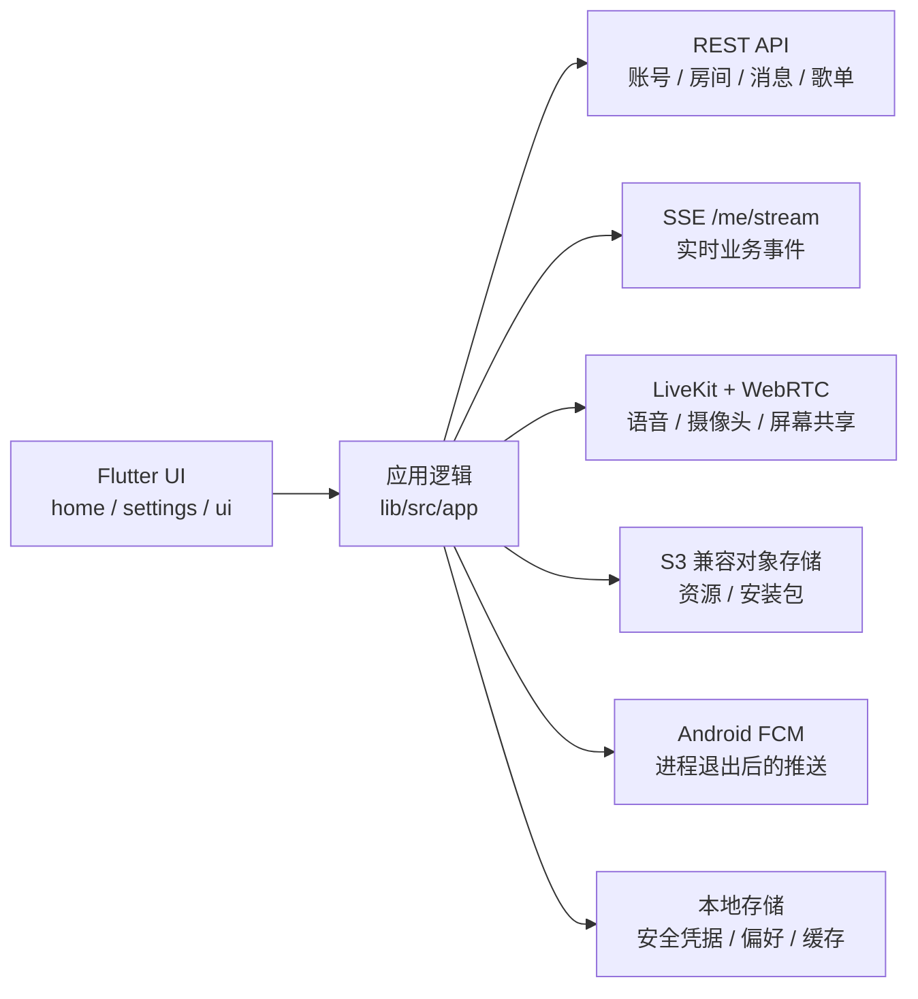

# Gang Chat


Gang Chat 是一个使用 Flutter 构建的跨平台房间聊天客户端，面向 Windows、macOS 和 Android。它把文字聊天、语音频道、摄像头、屏幕共享、房间管理、通知、表情包、文件传输和房间音乐盒放在同一个自适应界面中，并通过独立的 Gang Chat 服务端完成账号、消息和业务状态同步，通过 LiveKit/WebRTC 承载实时音视频。

> 本 README 以当前 `master` 分支的实际实现为准。仓库中虽然保留了 Linux、iOS 和 Web 的 Flutter 平台目录，但当前自动发布和主要回归范围是 Windows、macOS 与 Android。

## 目录

- [相关入口](#相关入口)
- [平台支持](#平台支持)
- [功能总览](#功能总览)
- [详细功能](#详细功能)
- [系统架构](#系统架构)
- [项目结构](#项目结构)
- [开发环境](#开发环境)
- [配置客户端](#配置客户端)
- [运行与调试](#运行与调试)
- [构建](#构建)
- [测试与质量检查](#测试与质量检查)
- [发布流程](#发布流程)
- [数据、权限与本地存储](#数据权限与本地存储)
- [常见问题](#常见问题)
- [开发约束](#开发约束)
- [进一步阅读](#进一步阅读)

## 相关入口

- 官网与客户端下载：[https://ky-z.com/gang-chat/home/](https://ky-z.com/gang-chat/home/)
- 客户端仓库：[gang-chat/gang-chat-client](https://github.com/gang-chat/gang-chat-client)
- 服务端仓库：[gang-chat/gang-chat-server](https://github.com/gang-chat/gang-chat-server)
- 主页仓库：[gang-chat/gang-chat-homepage](https://github.com/gang-chat/gang-chat-homepage)
- GitHub Releases：[客户端 Releases](https://github.com/gang-chat/gang-chat-client/releases)

官网会从对象存储的 `releases/` 目录读取可用版本，并分别提供 Windows 安装程序、macOS 磁盘映像和 Android APK。当前约定的正式版文件名为：

```text
GangChat_v<version>.exe
GangChat_v<version>.dmg
GangChat_v<version>.apk
GangChat-<version>-windows.zip
```

## 平台支持

| 能力 | Windows | macOS | Android |
| --- | --- | --- | --- |
| 正式发布产物 | `.exe`、便携 `.zip` | `.dmg` | `.apk` |
| 自适应宽屏/窄屏布局 | 支持 | 支持 | 支持 |
| 原生窗口控制区 | 自定义最小化/最大化/关闭 | 系统原生交通灯 | 不显示桌面窗口按钮 |
| 后台形态 | 系统托盘 | 桌面窗口生命周期 | 前台服务、系统通知、可选 FCM |
| 文字、文件、图片、语音、表情 | 支持 | 支持 | 支持 |
| 语音频道和摄像头 | 支持 | 支持 | 支持 |
| 屏幕共享 | 屏幕/窗口选择 | 屏幕/窗口选择 | MediaProjection 系统授权 |
| 屏幕共享声音 | 独立屏幕音轨 | 独立屏幕音轨 | Android 播放捕获，尽力而为 |
| 图片/摄像头/屏幕共享全屏 | 支持 | 支持 | 支持横竖屏切换 |
| 应用内更新 | 下载并启动安装程序 | 下载并打开 DMG | 后台下载并打开系统安装器 |
| 进程退出后的离线推送 | 不适用 | 不适用 | 需要发布包配置 FCM 和设备具备 Google Play 服务 |

Android 手机在普通界面默认使用竖屏，只有全屏图片、全屏摄像头或全屏屏幕共享等媒体场景允许横屏。Android 平板使用大屏判定并允许系统正常旋转，同时继续隐藏桌面端窗口控制按钮。

Linux、iOS 和 Web 目前不是正式发布目标；不要仅因为仓库存在对应 Flutter 目录就认为这些平台已经完成产品级适配。

## 功能总览

- 邮箱验证注册、登录、自动刷新会话、记住账号、找回密码和多设备会话管理。
- 公共/私密房间、开放/审批/关闭加入方式、邀请、申请、成员、角色和黑名单管理。
- 文字、链接、图片、文件、语音消息、表情、歌曲和歌单组件消息。
- 多条引用、`@` 提及、撤回、删除、未读数、跨设备已读同步和房间草稿。
- 房间通知中心、日期/类型/关键词筛选、Android 系统通知和桌面提醒。
- LiveKit 语音频道、麦克风/耳机状态、成员音量、管理操作、摄像头和屏幕共享。
- Windows、macOS、Android 屏幕共享及独立屏幕音频发布。
- 个人表情包、房间表情包、上传、保存、排序、筛选、下载和批量管理。
- 点歌队列、网易云/哔哩哔哩搜索、个人歌单、房间歌单、试听、分享、克隆、合并和批量添加。
- 自适应窄屏布局、嵌套用户名片/房间名片/歌曲名片/歌单名片和跨平台右键/长按交互。
- Windows、macOS、Android 自动检查更新、下载和安装衔接。

## 详细功能

### 1. 账号、登录与安全

#### 注册与登录

- 使用邮箱、登录用户名和密码注册账号。
- 注册前完成邮箱验证码校验，并检查邮箱和登录用户名是否可用。
- 支持简体中文、繁体中文和 English 登录文案与语言偏好。
- 登录页可以记住历史账号、头像和密码；敏感会话凭据通过安全存储保存。
- Access Token 失效时可使用 Refresh Token 刷新；认证请求对部分短暂 TLS 握手失败带有恢复逻辑。
- 支持退出当前账号，并在退出时清理实时连接、语音状态和 Android 推送注册关联。

#### 密码与邮箱

- 登录状态下修改密码。
- 忘记密码时发起邮箱验证码流程、检查冷却时间、重发验证码并设置新密码。
- 支持验证或更换邮箱绑定。
- 支持手机号绑定信息以及邮箱/手机号公开状态设置；具体可用性取决于服务端配置。

#### 账号资料

- 显示个人 UID 和登录用户名。
- 修改默认显示名、个人签名和性别。
- 选择内置头像，或上传图片、裁剪并设置自定义头像。
- 用户名、头像、身份标签在消息、通知、成员列表、搜索和名片中使用统一解析规则。
- 已注销用户、已删除房间或历史对象缺失时保留可理解的占位信息，避免历史消息失去上下文。

#### 登录会话与账号活动

- 查看近期登录会话。
- 标记当前会话，并显示设备系统、IP/位置和活动时间等服务端可用信息。
- 撤销其他会话。
- 查看账号创建时间和账号状态。
- 普通账号可在确认后注销；超级用户账号受额外保护。

#### 超级用户管理

超级用户可以通过顶部搜索进入用户设置，执行受权限保护的管理操作，包括：

- 查看和修改目标账号资料及公开信息。
- 查看目标账号的会话和服务端保存的语音音量设置。
- 重置目标账号密码。
- 封禁或解除封禁账号；封禁会撤销已有登录会话。
- 强制注销账号。
- 在房间权限允许时管理创建者、管理员和成员角色。

### 2. 主界面、自适应布局与搜索

- 宽屏下使用房间列表与当前房间并列的桌面布局。
- 窄屏和 Android 手机将房间列表与房间内容拆成独立页面，并接管系统返回键。
- Windows/macOS 窗口收窄后复用移动端友好的响应式排列，而不是简单裁切桌面内容。
- Android 平板按逻辑尺寸进入大屏布局，但不显示桌面端最小化、最大化和关闭按钮。
- 顶部搜索会根据可用宽度自动调整位置；搜索结果支持分页和分类。
- 普通用户可以搜索我的房间、公开房间、聊天记录和聊天文件。
- 超级用户可以在搜索中进入用户管理结果。
- 房间列表显示置顶状态、未读状态、最新消息、实时语音人数和房间时间。
- 网络信号角标可显示客户端到服务端的延迟；桌面支持悬停，触屏支持点击固定现有提示卡。
- 顶部语音快捷模块常驻显示当前语音状态；空间不足时会优先压缩房间名，同时保留麦克风、耳机等关键操作。

### 3. 房间与成员管理

#### 创建和编辑房间

- 设置房间名称、简介和房间图标。
- 选择内置房间图标，或上传并裁剪自定义图标。
- 设置可见性：公开或私密。
- 设置加入方式：开放、需审批或关闭。
- 显示房间 RID、创建时间、成员数、在线数和语音频道人数。
- 房间资料、用户名片和公共搜索结果可以互相嵌套打开，不丢失当前上下文。

#### 个人房间偏好

每个成员可以为每个房间单独设置：

- 房间备注名。
- 房间内专用用户名。
- 房间消息策略：全部、接收但不提醒、屏蔽。
- 是否置顶房间。
- 是否启用入场/离场 AI 语音播报。

房间备注名和房间内用户名只改变该用户或该房间中的展示，不会错误替换账号默认头像或账号级资料。

#### 加入、邀请和申请

- 直接加入开放房间。
- 向需审批房间提交申请理由。
- 撤回尚未处理的申请。
- 房间管理者查看并审批新成员申请。
- 邀请用户加入房间，被邀请者可接受或拒绝。
- 房间加入策略改变时，客户端通过实时事件更新入口和通知状态。

#### 成员与权限

- 成员页分为房间成员、新成员和黑名单。
- 按关键词、在线状态、语音状态和身份筛选成员。
- 显示成员、管理员、创建者和超级用户标签。
- 修改成员的房间内用户名和角色。
- 将成员移出房间、拉黑或从黑名单恢复。
- 转让房间创建者。
- 房间管理员及以上权限可以管理房间表情包、房间歌单、消息记录和部分语音操作。
- 所有危险操作使用确认窗口，窄屏时成员操作收进统一设置菜单，避免按钮溢出。

### 4. 文字聊天与消息组件

#### 可发送内容

- 普通文本、Unicode/emoji 和可点击链接。
- 一张或多张图片/文件附件。
- 语音消息。
- 个人表情和房间表情。
- 歌曲组件和歌单组件。
- 多条消息引用和 `@用户` 提及。

文件和组件可以先暂存在输入区；每个暂存项都有独立删除入口。歌曲/歌单组件与普通文字同时发送时，会先发送组件，再紧接着发送普通消息，保持组件的结构化数据。

#### 输入与草稿

- 每个房间独立保存未发送文字、引用和待发送附件。
- 切换房间后恢复对应草稿。
- 支持从系统剪贴板粘贴文本、图片、文件路径以及 Gang Chat 的歌曲/歌单组件数据。
- Windows/macOS 支持文件拖入；Android 使用系统文件选择器和触屏文本选择。
- 桌面端右键和 Android 长按使用同一套上下文菜单能力；Android 文本选择仍保留系统选择手柄和放大镜交互。

#### 消息展示与操作

- 连续消息按发送者、时间和系统事件规则分组。
- 服务器时间用于日期分隔和消息时间，降低本地时钟偏差造成的错序。
- 支持复制、引用、撤回、删除和跳转到引用消息。
- 支持多条引用，并在系统消息中隐藏不必要的发送者信息。
- 管理权限允许时可处理撤回申请或强制删除消息。
- 已撤回、被删除或关联用户已注销的消息显示稳定的历史占位状态。
- 当前房间自动同步已读状态；同一账号的其他设备可收到已读更新。
- `@我` 消息有独立高亮和未读导航。
- 长消息列表支持回到最新消息，并记住房间滚动位置。

#### 房间消息记录

房间设置中的消息记录支持：

- 关键词搜索。
- 开始/结束日期筛选。
- 按成员筛选。
- 按全部、链接、语音、表情、图片、文件、音乐和系统消息分类。
- 复制历史记录。
- 在权限允许时隐藏/删除符合条件的记录。

### 5. 图片、文件与语音消息

#### 图片

- 聊天图片可以打开全屏预览。
- 支持缩放、拖动、复制、下载/保存和添加到表情包。
- 控制按钮会在无操作后自动隐藏，鼠标移动或触屏操作后重新出现。
- Android 全屏预览允许横竖屏切换；退出后恢复手机普通界面的竖屏策略。
- 图片背景保留进入预览前的界面快照，避免横屏时把整个聊天 UI 重新排成横屏。

#### 文件

- 上传普通文件并显示文件名、类型和大小。
- 显示下载进度、成功状态和失败重试。
- Windows 可选择保存位置；其他平台通过平台文件能力保存或打开。
- 全局搜索可单独查找聊天文件。

#### 语音消息

- 在输入区录制、取消和发送语音消息。
- 发送期间先显示待发送气泡，避免长上传阻塞界面。
- 消息气泡显示时长、波形和播放进度。
- 语音播放使用独立的播放服务，不与语音频道麦克风开关混为一体。

### 6. 通知、未读与后台行为

#### 应用内通知中心

- 汇总房间邀请、加入申请、申请结果、角色变化、成员事件和其他房间事件。
- 支持全部、邀请、申请、房间分类。
- 支持关键词、日期范围和组合筛选。
- 支持复制、删除、批量选择和标记已读。
- 通知内容中的每个用户、房间、头像、图标和身份标签保持原位置，并可按权限打开对应名片。
- 窄屏下通知会自动换行，时间最多分两行，操作按钮保持垂直居中。

#### 桌面提醒

- 新消息可以播放应用内提示音。
- Windows 在窗口失焦时可以请求任务栏注意状态，并配合托盘图标提醒。
- 窗口重新聚焦后清除注意状态。
- 关闭窗口的行为可设置为每次询问、最小化到托盘或退出程序。

#### Android 通知

- 应用退到后台时以前台服务保持实时连接，后台状态仍视作在线。
- 从最近任务中划掉应用视作明确退出，客户端会尽力发送离开语音和清理实时状态。
- 当全局系统通知已开启，且房间消息策略为“全部”时，后台房间消息可显示消息内容。
- 系统通知支持按房间聚合、点击进入对应房间和应用图标数字角标。
- 更新 APK 可以在后台继续下载，完成后显示安装通知；没有通知权限时，重新打开 Gang Chat 会继续引导安装。
- 发布包配置 FCM 后，即使 Flutter 进程已结束，只要用户没有退出账号，服务端仍可向该设备推送离线通知。
- FCM 依赖 Google Play 服务。没有 Google 服务的设备仍可使用应用和后台实时连接，但进程结束后的推送需要额外接入对应厂商推送渠道。

### 7. 用户名片、房间名片与嵌套交互

- 用户头像或名字可以打开用户名片，显示资料、状态、角色、共同房间和 UID。
- 房间图标或名字可以打开房间名片，显示成员数、加入状态、可见性、加入策略、创建者和 RID。
- 名片中的用户、房间、创建者、共同房间可以继续打开下一层名片。
- 桌面使用悬停和点击固定，Android 使用点击/长按等触屏入口。
- 名片文字支持选择和复制；拖动 Android 选择手柄时不会误关闭名片。
- 窄卡片会根据真实可用宽度缩小头像或换行，优先保持“头像/图标 + 名称”为一个可理解的整体。

### 8. 语音频道

#### 基础状态

- 加入和离开房间语音频道。
- 加入前即可设置麦克风和耳机状态。
- 麦克风静音与耳机关闭是两个独立状态；关闭耳机会同步禁止本地收听，但不会错误地把远端所见麦克风状态保持为开启。
- 离开语音频道时记住本地麦克风/耳机偏好，下次加入时恢复；退出账号后恢复默认开启状态。
- 顶部快捷模块即使未加入语音频道也常驻，便于预设状态和快速返回当前语音房间。

#### 音频设备与音量

- 在设置中选择输入设备和输出设备。
- 可跟随系统默认设备，并在设备断开、Bluetooth 配置切换或自动重连后恢复可用设备。
- 调整输入音量、输出音量和屏幕共享声音音量。
- 音量设置保存在非敏感本地偏好中，不随普通软件升级重置。
- 支持麦克风输入测试、输出测试和实时输入电平。
- 对其他成员设置独立收听音量；滑块图标和静音状态随实际音量更新。
- Android 音乐盒使用媒体音量通道；语音频道继续使用实时通信所需的音频路由。

#### 成员和管理操作

- 显示实时在线成员、说话状态、麦克风、耳机、摄像头和屏幕共享状态。
- LiveKit 参与者列表和服务端房间计数会在重连后重新拉取并协调，避免外部人数与内部列表长期不一致。
- 播放加入/离开提示音，可选 AI 语音播报成员进出。
- 管理员可以静音成员麦克风、限制语音权限、恢复语音权限或踢出语音频道。
- 服务端权限和 LiveKit 轨道状态共同决定最终结果，客户端不只依赖本地乐观状态。

#### 自动重连

- SSE 实时流断线后使用指数退避和抖动重连。
- 重连成功会重新拉取房间、消息和实时状态快照，修复离线期间错过的事件。
- LiveKit 重连后恢复麦克风发布、耳机状态、摄像头/屏幕轨道订阅和成员列表。
- 被管理员踢出或撤销语音权限时不会把该断开误当成普通网络断线无限重连。

### 9. 摄像头与屏幕共享

#### 摄像头

- 发布或停止本地摄像头。
- 点击本人或其他成员的摄像头缩略图进行预览/全屏观看。
- 本人预览支持切换前后摄像头和镜像。
- 观看他人摄像头时可以仅对本地观看画面镜像，不影响发布者和其他观看者。
- 设备列表尚未授权时先请求权限；确定没有可切换摄像头时隐藏翻转操作。
- 开启屏幕共享时再开启摄像头会按与桌面端一致的轨道互斥/切换流程处理，避免同时启动导致崩溃。

#### 屏幕共享

- Windows/macOS 提供桌面屏幕和窗口来源选择器及缩略图。
- Android 使用系统 MediaProjection 授权共享整个设备画面。
- 共享前可设置 480p、720p 或 1080p，以及 15、30 或 60 FPS；实际输出仍受来源分辨率、设备能力和网络影响。
- 屏幕共享画质可以在共享过程中更新，桌面端尽量不重复弹出来源选择器。
- 点击远端屏幕共享缩略图会在需要时先加入语音频道，再开始观看；已在频道内则直接观看。
- 离开语音频道会清除观看目标，再次加入不会自动恢复上一次观看。
- 显示“谁正在看”列表，并把隐藏的屏幕音频辅助参与者排除在普通成员列表之外。
- 全屏观看时标题、观看者、关闭、全屏和音量控件会在无鼠标/触屏活动约 3 秒后隐藏；活动后立即恢复并重新计时。
- Windows 全屏观看时鼠标光标与控制栏一起显示或隐藏。
- Android 全屏会避开状态栏和系统导航区域，横屏时使用完整安全可视区。

#### 屏幕共享声音

- 屏幕声音作为独立的 `screenShareAudio` 轨道发布，不与麦克风轨道共用状态。
- Windows 使用系统/进程回环采集并尽量排除 Gang Chat 自身声音，降低回声风险。
- macOS 通过原生屏幕捕获能力接入共享声音。
- Android 使用 MediaProjection 的播放捕获能力；系统版本、内容保护策略和应用是否允许被捕获会影响结果。
- 屏幕视频优先：声音辅助连接失败时不会阻止画面继续共享。
- 本地用户不会订阅自己的屏幕共享声音，远端屏幕声音使用独立音量控制。

### 10. 音乐盒

音乐盒是房间语音频道中的服务端权威协同播放功能。播放状态、队列、当前歌曲、进度和活动来源由服务端同步，客户端负责操作、展示和缓存。

#### 面板布局

面板固定宽 340（窄于此时贴合正文宽度），自上而下为：

- 标题行：`音乐盒` 与右侧的当前来源标签（点歌队列 / 房间歌单名 / 个人歌单名）。有播放时标签带波形图标；点击标签把列表滚动到拥有该来源的区块：点歌队列滚到队列标题，已保存歌单展开所属分组并原地展开该歌单。右侧为关闭按钮。
- 正在播放：唱片、往返滚动的歌曲名、歌手；来源为点歌队列且有点歌人时显示点歌人标签。下方是进度条和播放控制行（上一首、播放/暂停、下一首、播放模式）。没有控制权限的成员看到的是一行“播放由房间管理员控制”，不渲染任何控制按钮。播放按钮仅在当前来源队列非空时可用。
- 音量。
- 正文：一个整体滚动的扁平列表，按顺序包含 `点歌队列`、`房间歌单`、`我的歌单` 三个区块。点歌队列始终展开；两个歌单分组默认折叠，点击分组标题展开或收起。哪些分组、哪个歌单处于展开状态只由用户决定，不会被服务端推送改写。

#### 点歌队列

点歌队列是每个房间的临时播放来源，位于列表顶部并始终展开：

- 标题行：`点歌队列 · N 首 · 正在播放/已暂停/未播放`，有播放时带波形图标。右侧依次为搜索开关和清空按钮（有权限且队列非空时出现，需确认）。没有“整队列播放”按钮：播放的单位始终是一首歌。
- 搜索开关：点击在标题下方展开一行搜索面板，包含输入框“搜索歌曲点歌”和来源分段选择（网易云 / 哔哩哔哩，QQ 音乐入口暂时隐藏）；展开时输入框自动聚焦，再次点击收起并清空搜索框。
- 输入非空时，点歌队列的歌曲行被搜索结果替换，下方两个歌单分组同时隐藏；清空或收起搜索即回到点歌队列。
- 搜索结果显示完整歌曲标题和作者/歌手；哔哩哔哩来源使用“作者”字段并显示 BV 号等详情。
- 搜索结果行只有一个 `+` 按钮加入点歌队列；相同具体链接已在队列中时按钮变为对勾并禁用，提示“已在点歌队列”。行内没有菜单；添加到歌单在歌曲名片里完成。
- 搜索失败在结果区内显示原因，不弹浮层。
- 队列为空时显示“点歌队列为空”，并提示点击右上角的搜索按钮点歌。

#### 播放控制与队列行

- 支持播放、暂停、上一首、下一首和播放模式切换，以及顺序、单曲循环、列表循环、随机等服务端模式。
- 队列行前缀为序号；下载/准备中显示加载状态，正在播放显示波形，失败显示错误图标；行内显示点歌人头像。
- 播放的单位是歌曲：点歌队列为当前来源时，就绪且非当前的歌曲显示行内“优先播放”，立即播放所选点歌并把它放到刚才播放歌曲之后；正在播放已保存歌单时，每首点歌显示“从这首歌开始播放点歌队列”，点击后把房间切回点歌队列并从这首歌起播（需要切换权限）。
- 有删除权限时行尾显示行内危险色 `×`“从点歌队列删除”。队列行不提供菜单按钮或右键菜单；添加到歌单在歌曲名片里完成。
- 打开面板时自动把正在播放的歌曲滚动到可见位置。
- 长歌曲名使用横向往返展示，确保完整内容可以被看到。

#### 房间歌单与我的歌单

两个分组只负责播放已保存歌单，歌单的编辑在设置页和房间设置页完成：

- 分组标题显示 `房间歌单` / `我的歌单`、展开箭头和加载后的歌单数量；当前来源属于该分组且有播放时标题带波形图标。分组在第一次展开时加载歌单列表，之后歌单被编辑时自动重新加载；加载中显示转圈，失败提供重试。
- 正在播放但不在列表中的来源（例如他人的个人歌单）会置顶显示。
- 歌单行本身没有播放按钮，也不能整单播放；播放总是从歌单里某一首歌开始，点击那首歌会把房间的当前来源切换到该歌单并从它起播。歌单图标悬停显示歌单名片，可查看（原地展开）或编辑歌单。
- 点击歌单行在原地展开其歌曲，同一时间只展开一个歌单；再次点击收起。
- 歌单不是当前来源时，展开的是歌单模板，歌曲行只有一个“从这首歌开始播放歌单”按钮，没有加入点歌队列或添加到歌单的行内动作；歌曲名片只展示信息，保留名片自身的“添加到歌单”，不提供“点歌队列”。
- 该歌单正在播放时，展开的是服务端激活快照（与点歌队列行相同的序号和优先播放，不提供删除），而非可编辑的歌单模板。
- 个人歌单或房间歌单为空时，在有权限的情况下显示“新建第一个歌单”并跳转到对应设置页；面板内不会创建新路由。
- 面板内不再提供本地试听；试听保留在设置页。

#### 歌曲名片

歌曲名片可以显示：

- 歌曲名称和音乐图标。
- 时长。
- 歌手；哔哩哔哩来源显示作者。
- 来源。
- 点歌人，或“房间歌单 / 用户头像 + 用户名的歌单 · 歌单名”。
- 哔哩哔哩 BV 号等来源详情。
- 正在播放、优先播放、已在队列中、点歌队列和添加到歌单等上下文操作；展开的歌单里预设歌曲的名片只展示信息并保留“添加到歌单”，不提供“点歌队列”。设置页和只读歌单窗口中的歌曲名片另提供试听/取消试听。

点歌人头像嵌套现有用户名片；歌单图标和歌单名称嵌套歌单名片。试听先下载到本地预览缓存，关闭名片或点击取消试听后停止播放；语音频道耳机开启时会按当前冲突策略限制或隔离试听。

#### 个人歌单

- 每个账号最多保存 50 个个人歌单。
- 每个歌单最多 500 首歌曲。
- 新建、重命名、删除、置顶、移动和筛选歌单。
- 搜索歌曲并添加到歌单。
- 对歌单内歌曲试听、分享、删除、重排、筛选和批量管理。
- 批量“添加到歌单”按所选顺序复制歌曲，不删除原歌曲。
- 以 `来源 + 外部歌曲 ID` 对具体链接去重，不只比较显示名称。
- “合并歌单”按选择顺序合并、去重并创建新歌单；已完整处理的来源歌单会删除，超过 500 首时保留未处理部分并明确提示。
- 即使已有 50 个歌单，只要合并会释放来源歌单名额，服务端仍可在事务中完成合并。
- 将歌单分享到房间文字频道，发送不可变歌单快照。

#### 房间歌单

- 每个房间最多保存 50 个房间歌单，每个歌单最多 500 首。
- 仅房间管理员及以上权限可以新建和管理。
- 新建房间歌单时可以导入并克隆一个个人歌单。
- 支持重命名、排序、置顶、合并和批量添加歌曲。
- 单个房间歌单可以克隆到我的歌单，名称使用“房间备注名/房间名 · 歌单名”。
- 克隆、合并、批量添加和上限裁剪都由服务端事务处理，避免留下空歌单或部分写入的不一致状态。

#### 歌单名片与分享快照

歌单名片显示：

- 歌单名称和歌曲数量。
- 创建人或所属房间，并支持嵌套用户名片/房间名片。
- 创建日期；临时点歌队列不显示创建日期。
- 正在播放状态。
- 清空队列、查看歌单或编辑歌单等权限相关操作。

分享至聊天的歌单和歌曲以结构化组件展示：

- 右键复制后，在 Gang Chat 输入框粘贴可恢复组件，而不是只留下普通文字。
- 输入区组件带有独立的 `×`，可在发送前移除。
- 点击歌单组件打开歌单名片，点击箭头打开只读歌曲窗口或有权限时进入编辑页。
- 只读歌单窗口中的歌曲仍支持歌曲名片、试听和添加到歌单。
- 他人歌单快照可以克隆到我的歌单；源歌单之后重命名或删除不影响已发送的历史快照。

#### 一致性与刷新

- 个人/房间歌单在设置页编辑成功后发出失效修订号。
- 已打开的语音频道音乐盒会重新加载最新歌单摘要和歌曲，丢弃迟到的旧异步结果。
- 同 ID 的已保存歌单发生编辑时，只更新浏览模板；已经激活的播放快照保持不变，不会在播放途中被设置页改写。
- 服务端进度心跳只更新进度相关字段，不覆盖客户端已经加载的新功能状态。

更完整的状态机、错误契约、容量和测试规则见 [新音乐盒完整实现方案](docs/music-box-next-generation-design.md) 与 [音乐盒客户端 API 契约](docs/music-box-api.md)。

### 11. 表情包

- 个人表情包和房间表情包分开展示。
- 空个人表情包显示“上传第一个表情”；空房间表情包仅在当前用户有管理权限时提供上传入口。
- 上传图片或 ZIP，并在需要时自动创建默认表情包。
- 批量上传、批量选择、删除、重命名、筛选、排序和置顶。
- 下载选中表情或表情包。
- 将聊天图片保存到个人表情包；管理员可以保存到房间表情包。
- 发送后的表情可预览、复制、下载或再次保存。
- 上传、保存和删除操作具有重复请求保护，网络重试不会轻易生成重复表情。

### 12. 设置

设置页包含以下部分：

#### 用户资料

- UID、登录用户名、显示名、性别、头像和签名。
- 自定义头像上传、裁剪和内置头像选择。

#### 偏好设置

- Windows/macOS 关闭窗口行为。
- Android 系统通知总开关和系统通知设置入口。
- 简体中文、繁体中文和 English 语言选择。

#### 隐私和安全

- 邮箱/手机号绑定与公开状态。
- 修改或找回密码。
- 登录会话、设备系统、IP/位置和撤销会话。
- 账号状态和注销账号。

#### 语音和视频

- 输入/输出设备。
- 输入、输出和屏幕共享音量。
- 麦克风和输出测试。
- 屏幕共享分辨率及帧率。
- 设备偏好恢复和本地持久化。

#### 我的表情包

- 上传、管理、排序、筛选、批量操作和下载。

#### 我的歌单

- 完整的个人歌单和歌曲管理能力。

#### 关于 Gang Chat

- 当前版本、发行时间和上次更新时间。
- 自动提示更新开关。
- 手动检查新版本、忽略指定版本和下载安装。
- 意见反馈入口。

### 13. 自动更新

- 客户端从配置的 S3 兼容对象存储列出 `releases/` 资源，并按语义版本选择当前平台的最新安装包。
- Windows 下载 `.exe` 后以系统权限启动安装程序，并退出当前应用。
- macOS 下载 `.dmg` 后使用系统 `open` 打开镜像，并退出当前应用。
- Android 校验 APK 长度、ZIP/APK 结构和文件扩展名，再通过 `FileProvider` 打开系统安装界面。
- Android 允许后台下载；下载进度显示在前台服务通知中。
- Android 安装完成前应保持账号和任务状态，不需要一直停留在前台，但不应主动退出 Gang Chat。
- Android 系统必须允许“安装未知应用”；应用无法绕过系统确认步骤。
- 本地的音频设备、输入/输出音量、屏幕共享音量、关闭行为和语言等偏好通过稳定键名和迁移逻辑保存，不应因覆盖安装普通新版本而重置。

## 系统架构



### REST API

账号、房间、消息、通知、文件元数据、表情包、歌单和音乐盒控制通过带 Bearer Token 的 REST API 完成。客户端不在 Widget 中直接拼请求体，而是通过 `lib/src/protocol` 和 `lib/src/app` 的 controller 进入。

### SSE 实时事件

客户端维护 `GET /api/v1/me/stream` 长连接：

- 解析服务端事件并更新房间、消息、通知、已读、角色和实时状态。
- 35 秒无任何字节时由 watchdog 判定连接失活。
- 连接失败后使用指数退避与随机抖动重连。
- 每次成功连接后重新拉取权威快照，修复断线期间漏掉的事件。

### LiveKit 与 WebRTC

- LiveKit 负责语音、摄像头和屏幕视频轨道。
- 服务端签发房间 Token，并把管理权限同步到 LiveKit。
- 屏幕共享声音使用第二个隔离的 PeerConnectionFactory/辅助参与者发布，避免和麦克风 AudioDeviceModule 相互干扰。
- `third_party/flutter_webrtc` 和 `third_party/livekit_client` 包含 Gang Chat 所需的平台修复；不能随意替换成上游包而不做完整音视频回归。

### 对象存储与资源缓存

- 头像、房间图标、附件和表情通过服务端资源地址加载。
- 客户端统一解析历史绝对 URL、相对资源路径和当前资源域名。
- 下载文件、图片、音乐试听和实时提示音使用各自的缓存/临时目录。
- 更新检查直接读取公开对象存储中的发布文件列表。

### Android 原生桥接

Android Kotlin 层负责：

- 前台后台服务和任务划除通知。
- 系统通知权限、数字角标和房间通知。
- FCM Token 获取和通知点击路由。
- APK 后台下载、校验、FileProvider 和系统安装器。
- 屏幕旋转、全屏系统 UI、媒体音量路由和系统能力调用。

## 项目结构

```text
gang-chat-client/
├─ android/                    Android Activity、服务、通知、更新和原生桥
├─ assets/
│  ├─ branding/               应用品牌资源
│  └─ config/app_config.json  默认 API、资源和发布地址
├─ docs/                       架构、音乐盒、发布和平台移植文档
├─ installer/windows/          NSIS Windows 安装程序
├─ integration_test/           依赖真实平台/设备的探针测试
├─ lib/
│  ├─ main.dart                Flutter 入口
│  └─ src/
│     ├─ app/                  纯业务规则、状态、controller、display helper
│     ├─ auth/                 登录、注册、刷新 Token 和凭据接口
│     ├─ config/               构建时/资源配置
│     ├─ home/                 主界面、聊天、房间、Live、音乐盒 UI
│     ├─ live/                 LiveKit/WebRTC 和音频设备适配层
│     ├─ protocol/             REST API、模型、错误映射和 JSON
│     ├─ settings/             设置、表情包和歌单管理 UI
│     ├─ shell/                应用壳、窗口、剪贴板、更新、平台服务
│     └─ ui/                   可复用 UI 组件
├─ macos/                      macOS Runner、签名权限和原生窗口
├─ test/
│  ├─ unit/                    app/protocol/live/shell 单元测试
│  └─ widget/                  ui/home/settings/shell Widget 测试
├─ third_party/
│  ├─ audioplayers_windows/   Windows 本地音频播放修复
│  ├─ flutter_webrtc/         Gang Chat WebRTC 平台扩展
│  └─ livekit_client/         Gang Chat LiveKit 客户端扩展
├─ tool/                       UTF-8、发布元数据等脚本
├─ windows/                    Windows Runner 和原生窗口代码
└─ pubspec.yaml
```

更严格的层级职责和依赖方向见 [模块化开发指南](docs/modular-development-guide.md)。

## 开发环境

### 通用要求

- Flutter `3.44.0` stable。
- Dart `3.12.0`（随 Flutter 3.44.0 提供）。
- Git。
- 可访问 Gang Chat 服务端、LiveKit 和资源存储的网络环境。

获取依赖：

```powershell
flutter pub get
```

依赖版本在 `pubspec.yaml` 中精确固定。仓库通过 `dependency_overrides` 使用三个本地修复包：

- `third_party/audioplayers_windows`
- `third_party/flutter_webrtc`
- `third_party/livekit_client`

不要在没有验证三端音视频、试听、重连和屏幕共享的情况下移除这些 override。

### Windows

- Windows 10/11 64 位。
- Visual Studio 2022，安装“使用 C++ 的桌面开发”。
- Windows 10/11 SDK、CMake 和 Ninja（Flutter 工具链会检测）。
- 发布安装程序还需要 NSIS；GitHub Actions 使用 Chocolatey 安装。

检查环境：

```powershell
flutter doctor -v
flutter devices
```

### macOS

- macOS 10.15 或更高版本。
- Xcode 和命令行工具。
- CocoaPods。
- 摄像头、麦克风和屏幕录制权限。

```bash
sudo xcode-select --switch /Applications/Xcode.app/Contents/Developer
flutter doctor -v
flutter devices
```

### Android

- Android Studio 或独立 Android SDK。
- JDK 17（发布工作流使用 Temurin 17）。
- Android SDK Platform、Build Tools、Platform Tools。
- 真机调试需要开启开发者选项和 USB 调试；无需安装 OPPO 互联等厂商互联软件。

Windows 上连接真机：

1. 手机进入“设置 → 关于本机/版本信息”，连续点击版本号开启开发者选项。
2. 在“系统设置/其他设置 → 开发者选项”中开启 USB 调试。
3. USB 用途选择“传输文件 / Android Auto”更便于驱动识别；ADB 授权完成后具体文件模式通常不影响调试。
4. 在手机上接受这台电脑的 RSA 调试授权。
5. 执行：

```powershell
adb devices
flutter devices
```

如果列表显示 `unauthorized`，解锁手机并重新确认 USB 调试授权；如果完全没有设备，安装手机厂商 USB 驱动或更新 Android Platform Tools。

## 配置客户端

默认配置位于 `assets/config/app_config.json`：

```json
{
  "api_base_url": "https://ky-z.com/gang-chat/api/v1",
  "asset_base_url": "https://ky-z.com/gang-chat",
  "release_bucket_url": "https://os.ky-z.com:9000/gang-chat"
}
```

配置优先级从高到低为：

1. `--dart-define`。
2. `assets/config/app_config.json`。
3. `lib/src/config/app_config.dart` 中的开发回退值。

支持的构建变量：

| 变量 | 用途 |
| --- | --- |
| `GANG_API_BASE_URL` | REST API 根地址，必须包含 `/api/v1` |
| `GANG_ASSET_BASE_URL` | 头像、附件、表情等资源根地址 |
| `GANG_RELEASE_BUCKET_URL` | 自动更新使用的对象存储 Bucket 地址 |

本地服务端示例：

```powershell
flutter run -d windows `
  --dart-define=GANG_API_BASE_URL=http://127.0.0.1:21116/api/v1 `
  --dart-define=GANG_ASSET_BASE_URL=http://127.0.0.1:21116 `
  --dart-define=GANG_RELEASE_BUCKET_URL=https://os.ky-z.com:9000/gang-chat
```

Android 真机不能使用电脑的 `127.0.0.1`。请使用手机可访问的局域网/HTTPS 地址，并确保 Android 网络安全策略允许该开发地址。

## 运行与调试

### Windows

```powershell
flutter run -d windows
```

常用热重载按键：

- `r`：Hot Reload。
- `R`：Hot Restart。
- `q`：结束调试。

### macOS

```bash
flutter run -d macos
```

第一次使用摄像头、麦克风或屏幕共享时，在“系统设置 → 隐私与安全性”授予对应权限。权限改变后可能需要完全重启 Gang Chat。

### Android

```powershell
flutter run -d <device-id>
```

查看设备 ID：

```powershell
flutter devices
```

排查原生日志：

```powershell
adb logcat | Select-String -Pattern "GangChat|flutter|LiveKit|WebRTC"
```

屏幕共享、后台服务、安装 APK、系统通知和 FCM 必须在 Android 真机上验证；普通 Widget 测试无法替代这些平台测试。

## 构建

### Windows Release

```powershell
flutter build windows --release
```

输出目录：

```text
build/windows/x64/runner/Release/
```

入口程序名为 `GangChat.exe`。正式 GitHub Actions 还会使用 NSIS 生成 `GangChat_v<version>.exe`，并生成便携 ZIP。

### macOS Release

```bash
flutter build macos --release
```

输出应用：

```text
build/macos/Build/Products/Release/client.app
```

正式发布流程会将 App 打包为 `GangChat_v<version>.dmg`。签名资料完整时还会执行 Developer ID 签名、公证和 stapling。

### Android Debug APK

```powershell
flutter build apk --debug
```

输出：

```text
build/app/outputs/flutter-apk/app-debug.apk
```

本地默认版本为 `1.0.0+1`，所以普通 Android/Windows Debug 界面显示 `1.0.0`。

### Android Release APK

```powershell
flutter build apk --release
```

如果没有提供完整的正式签名环境变量，本地构建可以使用项目的调试签名回退；GitHub Release 工作流不允许这种回退，缺少正式签名会直接失败。

发布签名环境变量：

- `ANDROID_KEYSTORE_PATH`
- `ANDROID_KEYSTORE_PASSWORD`
- `ANDROID_KEY_ALIAS`
- `ANDROID_KEY_PASSWORD`

不要提交 keystore、`key.properties`、Firebase 配置或任何私钥。

## 测试与质量检查

### 快速检查

```powershell
dart tool/check_utf8.dart
flutter analyze
flutter test --no-pub
```

### 按层运行测试

```powershell
flutter test --no-pub test/unit/app
flutter test --no-pub test/unit/protocol
flutter test --no-pub test/unit/live
flutter test --no-pub test/unit/shell
flutter test --no-pub test/widget/ui
flutter test --no-pub test/widget/home
flutter test --no-pub test/widget/settings
flutter test --no-pub test/widget/shell
```

### 平台探针

真实音频设备枚举：

```powershell
flutter test integration_test/audio_enumeration_probe_test.dart -d windows
```

屏幕共享画质探针：

```powershell
flutter test integration_test/screen_share_quality_probe_test.dart -d windows
```

探针依赖真实操作系统、权限、设备和插件运行时，不属于默认快速回归套件。

### 测试目录规则

- 不创建 Flutter Widget 树的纯逻辑测试放在 `test/unit/<module>/`。
- 布局、焦点、鼠标、触屏、选择、菜单和渲染测试放在 `test/widget/<module>/`。
- 依赖真实设备、摄像头、音频硬件、系统权限或原生插件的场景放在 `integration_test/`。
- 缺陷修复应先添加最小复现，再覆盖相邻边界和异步销毁安全。
- 修改跨层功能时，除聚焦测试外还应执行全量 `flutter analyze` 和 `flutter test --no-pub`。

## 发布流程

`.github/workflows/release.yml` 在推送 `v*` Tag 或手动输入版本时执行：

1. 校验 `major.minor.patch` 版本格式。
2. 生成 Android `versionCode = major * 1,000,000 + minor * 1,000 + patch`。
3. 更新构建中的版本和发行时间元数据。
4. 并行构建 Windows、macOS 和 Android。
5. 校验签名状态与 Android APK 签名。
6. 发布 GitHub Release 和全部安装资产。

### 签名策略

- Windows：配置完整证书时执行 Authenticode 签名和时间戳；完全未配置时允许明确标记的未签名构建；只配置一部分则失败。
- macOS：配置完整 Developer ID 和 App Store Connect API Key 时执行签名、公证和 stapling；完全未配置时允许明确标记的未签名构建；部分配置则失败。
- Android：正式发布必须提供固定 release keystore，缺失或无效时失败，防止发布无法覆盖升级的临时签名 APK。
- Android FCM：`FIREBASE_GOOGLE_SERVICES_JSON_BASE64` 可选；缺失时 APK 仍可使用，但进程退出后的 FCM 推送不可用。

完整 Secret 名称、签名命令和验证方法见 [Release workflow](docs/release-workflow.md)。

## 数据、权限与本地存储

### 服务端数据

账号、房间、成员、消息、通知、表情包元数据、个人歌单、房间歌单和音乐盒权威状态由 `gang-chat-server` 保存。客户端缓存不能替代服务端权威状态。

### 敏感本地数据

- Refresh Token 等敏感凭据保存在 `flutter_secure_storage`。
- 不要在日志、测试 fixture、截图、Issue 或提交中暴露真实 Token、密码、证书和生产数据库内容。

### 非敏感本地偏好

以下内容使用 `shared_preferences` 或平台偏好存储：

- API/界面相关的本地选择。
- 输入/输出设备签名。
- 输入、输出和屏幕共享音量。
- 屏幕共享画质与帧率。
- Windows/macOS 关闭方式。
- 自动更新提示和忽略版本。
- 语言和登录账号历史等非敏感展示信息。

本地偏好包含迁移逻辑，覆盖安装新版本时不应因存储键变化而静默重置。

### Android 权限

Android 清单声明的主要权限包括：

- 网络访问和网络状态。
- 摄像头。
- 麦克风和音频设置。
- Bluetooth/附近设备音频连接。
- 通知。
- 前台数据同步、远程消息和麦克风服务。
- 请求安装 APK。

摄像头不是强制硬件；没有摄像头的设备仍可以使用文字、语音收听和其他功能。权限只应在功能实际需要时请求。

### 不应作出的安全假设

本仓库没有把“端到端加密”声明为产品能力。不要将 HTTPS、LiveKit 传输安全或安全存储描述为端到端加密；服务端仍参与账号、消息和媒体授权流程。

## 常见问题

### Android 收不到进程退出后的消息通知

依次检查：

1. 设置 → 偏好设置 → 系统通知已开启。
2. Android 系统设置已允许 Gang Chat 通知。
3. 对应房间的消息策略是“全部”，不是“接收但不提醒”或“屏蔽”。
4. 安装包构建时包含与 `com.gangchat.client` 匹配的 Firebase 配置。
5. 服务端配置了同一 Firebase 项目的服务账号。
6. 手机具备可工作的 Google Play 服务且没有被厂商后台策略完全限制。

OPPO 等无 Google 服务的国内机型无法仅靠 FCM 在进程结束后接收通知，需要以后接入 OPPO Push 等厂商通道。应用仍可在前台或后台服务存活时通过 SSE 接收消息。

### Android 自动更新下载完成但没有立即出现安装界面

- 检查是否允许 Gang Chat“安装未知应用”。
- 检查系统通知权限；后台完成时通常通过通知提示点击安装。
- 没有通知权限时重新打开 Gang Chat，客户端会检查已完成下载并再次启动安装流程。
- 某些系统的安装器会在“正在准备”停留一段时间；APK 已经过基本完整性检查，但系统仍会执行自己的包解析和安全扫描。

### Windows/macOS 提示安装包不受信任

发布流程允许在完全没有桌面签名 Secret 时生成明确标记的未签名产物。请优先使用已签名的正式版本，并按 [发布文档](docs/release-workflow.md) 验证签名。不要在不确认来源的情况下绕过系统安全提示。

### 语音频道没有声音或不能说话

- 确认麦克风和耳机按钮状态。
- 在设置 → 语音和视频中检查输入/输出设备与音量。
- 检查系统麦克风权限和应用音量混音器。
- Bluetooth 设备切换通话/媒体配置后，等待客户端重新绑定系统默认设备，必要时重新选择设备。
- 若刚从断网或休眠恢复，等待实时连接和 LiveKit 完成重连；仍异常时离开语音频道后重新加入，并保留日志用于排查。

### 屏幕共享没有声音

- 部分 DRM/受保护内容禁止系统捕获音频。
- Android 只有允许 Playback Capture 的应用声音可以被捕获。
- Windows/macOS 需要系统授予屏幕录制和音频相关权限。
- 屏幕音频使用独立辅助连接，网络或 LiveKit 发布失败时可能只有画面；日志中搜索 `screen-audio` 可查看原因。

### Android 真机无法被 Flutter 发现

```powershell
adb kill-server
adb start-server
adb devices
```

然后重新插拔 USB、确认 USB 调试授权和驱动。仅安装 OPPO 互联等文件互传应用不会自动开启 ADB 调试。

### 修改了歌单，但语音频道音乐盒仍显示旧内容

当前实现会在歌单成功编辑后递增客户端失效修订号，并在音乐盒中重新加载。如果仍显示旧数据：

- 确认编辑请求实际成功并出现成功提示。
- 重新打开音乐盒，或收起再展开 `房间歌单` / `我的歌单` 分组触发重新加载。
- 区分“歌单模板”和“已经激活的播放快照”：编辑保存歌单不会修改正在播放中的不可变快照，这是预期行为。
- 正在播放的已保存歌单在面板内展开时，列出的是激活快照（服务端队列），而不是可编辑的歌单模板；要看模板请进入设置页编辑，或等待该歌单不再是当前来源。

## 开发约束

### 模块依赖

推荐依赖方向：

```text
protocol/config
  -> app
  -> shell/live adapters
  -> feature UI (home/settings)
  -> reusable ui
```

关键要求：

- `lib/src/app` 保持 Flutter UI 和平台插件无关。
- UI 不直接拼 API 请求，不直接操作 secure storage、文件选择器或 LiveKit 原生类型。
- 平台能力通过 `lib/src/shell` 或 `lib/src/live` 的小接口注入。
- 可复用控件进入 `lib/src/ui`，只属于单个功能的大块 UI 留在对应 feature 文件。
- 不在页面 Widget 中复制已有 controller 的搜索、权限、排序和状态同步规则。

### 依赖和锁文件

- `pubspec.yaml` 中依赖使用精确版本，避免 `pub get` 静默升级。
- 有意升级依赖时才同时更新 `pubspec.yaml` 和 `pubspec.lock`。
- 普通功能修改不要无原因重写 `pubspec.lock`。
- 本地 override 是当前平台兼容实现的一部分，升级前必须审计差异。

### 跨平台和响应式要求

- 新功能必须考虑 Windows、macOS、Android 三端。
- Android 专属修复使用明确的平台边界，不能改变桌面行为。
- 窄屏不能依赖固定像素凑布局；使用真实约束决定换行、缩放、滚动或收起。
- 所有异步回调、Timer、Animation 和 Pointer 监听在 Widget 销毁后不得调用 `setState`。
- 鼠标、键盘、触屏、长按和文本选择要分别覆盖，不能把“长按”简单模拟成永久悬停。
- 修改语音、摄像头、屏幕共享或本地试听时，必须检查资源释放、重连、应用失焦/聚焦和任务退出。

### 提交前建议

```powershell
dart format --output=none --set-exit-if-changed lib test
dart tool/check_utf8.dart
flutter analyze
flutter test --no-pub
git diff --check
```

涉及服务端协议时还应在相邻的 `gang-chat-server` 仓库运行相应 Go 测试；涉及官网发布链接时在 `gang-chat-homepage` 运行：

```powershell
npm test
```

## 进一步阅读

- [解耦后的模块化开发指南](docs/modular-development-guide.md)
- [新音乐盒完整实现方案](docs/music-box-next-generation-design.md)
- [音乐盒客户端 API 契约](docs/music-box-api.md)
- [Release workflow](docs/release-workflow.md)
- [Windows 屏幕共享音频独立轨道移植指南](docs/windows-screen-audio-port.md)
